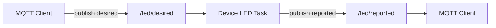

# MQTT Data Model

This project uses a simple topic model for LED control and button reporting.

## LED Control

Topics:

- Device subscribes to: `<thing>/led/desired`
- Device publishes to: `<thing>/led/reported`

Payload formats:

- JSON desired-state payloads (recommended)
- Raw fallback commands:
  - `LED_RED_ON`, `LED_RED_OFF`
  - `LED_GREEN_ON`, `LED_GREEN_OFF`

## Button Reporting

Topic:

- Device publishes to: `<thing>/sensor/button/reported`

Behavior:

- Publication occurs on button press/release transitions.
- Payload reports `USER_Button` state as `ON` or `OFF`.

## References

- LED guide: [Appli/Common/app/led/readme.md](../Appli/Common/app/led/readme.md)
- Button guide: [Appli/Common/app/button/readme.md](../Appli/Common/app/button/readme.md)
