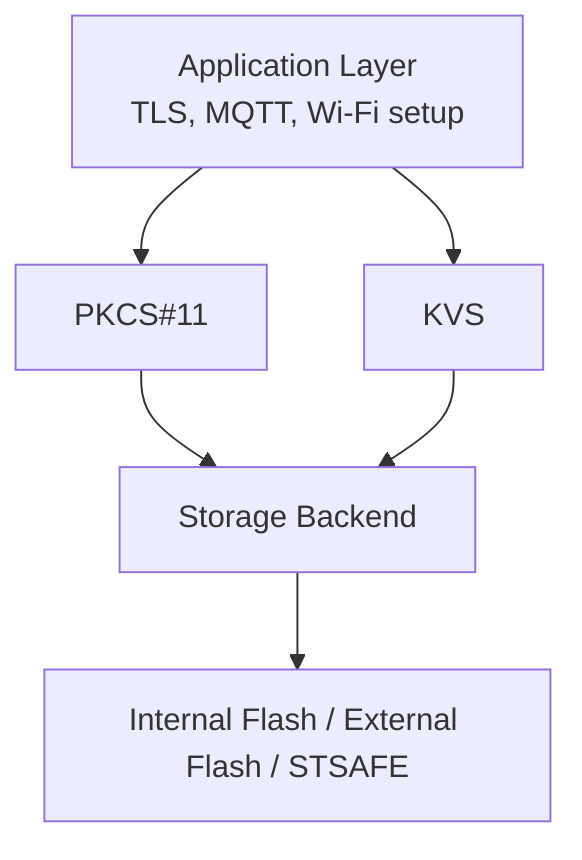

# Software Components

This firmware stack is built on a focused set of core components.

## Core Stack

- FreeRTOS kernel
- LwIP network stack
- MbedTLS TLS/crypto library
- PKCS#11 object interface
- FreeRTOS CLI

## FreeRTOS CLI

The FreeRTOS CLI is used for runtime setup, provisioning, and diagnostics.

See:

- [Appli/Common/cli/ReadMe.md](../Appli/Common/cli/ReadMe.md)

## PkiObject API

The PkiObject layer handles representation/conversion of certificates and keys used by TLS and provisioning flows.

See:

- [Appli/Common/crypto/ReadMe.md](../Appli/Common/crypto/ReadMe.md)

## Security and Storage Architecture

PKCS#11 and KVS are intentionally separated:

- PKCS#11: cryptographic objects (device key/certificates, CA certificates)
- KVS: runtime configuration (MQTT endpoint/port, Wi-Fi credentials, thing name)

This provides a flexible architecture where keys and runtime configuration can be placed in internal flash, external flash, or a secure element (STSAFE) without changing high-level application logic.
In practice, PKCS#11 and KVS abstract the application from storage medium details and security implementation choices.

